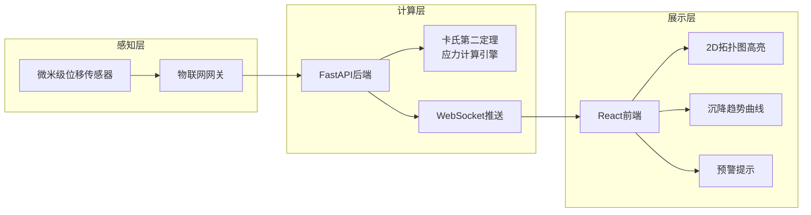

## 1. 产品概述

本系统为国家级文保单位木结构古建筑（如全木钟楼）提供榫卯关节微米级沉降与受力安全预警。通过在核心榫卯节点部署微米级拉线位移传感器，结合材料力学卡氏第二定理逆向推导应力，以2D拓扑图实时展示古建骨架健康状态。

- 核心价值：将不可见的微米级结构位移转化为直观的应力安全指标
- 目标用户：文物保护部门、古建筑监测工程师、结构安全研究员

## 2. 核心功能

### 2.1 用户角色

| 角色 | 登录方式 | 核心权限 |
|------|----------|----------|
| 监测工程师 | 账号登录 | 实时监测、历史数据查询、预警阈值设置 |
| 管理员 | 账号登录 | 全部功能 + 节点管理 + 系统配置 |

### 2.2 功能模块

1. **监测总览页**：2D拓扑骨架图、核心节点应力卡片、沉降趋势曲线、预警信息栏
2. **节点详情页**：单节点位移时序图、应力计算结果、历史数据对比
3. **预警中心页**：预警规则配置、预警历史记录、预警等级统计

### 2.3 页面详情

| 页面名称 | 模块名称 | 功能描述 |
|----------|----------|----------|
| 监测总览页 | 古建骨架2D拓扑图 | SVG绘制木构架拓扑，节点按应力等级高亮着色，鼠标悬停显示详情 |
| 监测总览页 | 核心节点应力卡片 | 横向滚动卡片，展示剪切力/弯矩/位移，按严重程度排序 |
| 监测总览页 | 沉降趋势曲线 | ECharts多线图，展示关键节点24小时位移趋势 |
| 监测总览页 | 预警信息栏 | 顶部横幅展示最新预警，支持快速跳转至相关节点 |
| 节点详情页 | 位移时序图 | 微米级位移的高频采样曲线，支持时间范围选择 |
| 节点详情页 | 应力计算面板 | 卡氏第二定理计算的剪切力、弯矩、应力云图 |
| 预警中心页 | 预警规则配置 | 设置各节点的位移阈值和应力阈值，分级预警 |
| 预警中心页 | 预警历史列表 | 按时间/等级筛选的预警记录，支持导出 |

## 3. 核心流程

物联网网关高频采集位移数据 → FastAPI后端接收并基于卡氏第二定理计算应力 → 实时推送至前端WebSocket → 2D拓扑图动态更新节点颜色与数值 → 触发阈值时弹出预警

## 4. 用户界面设计

### 4.1 设计风格

**设计理念**：古韵新诠 —— 以古建木构的温暖质感为基底，融入现代数据监测的科技理性

- **主色调**：深檀木棕 `#4A2C20` 作为主色，呼应木结构本色
- **强调色**：青铜金 `#C9A961` 用于关键数据与高亮，暗合古建铜饰
- **数据色**：松石青 `#2E8B8B` 用于正常状态、琥珀橙 `#E07B39` 用于预警、朱砂红 `#B8342A` 用于危险
- **背景色**：宣纸米白 `#F5F0E6` 与墨灰渐变，营造古卷氛围
- **字体**：标题使用「思源宋体」呼应古建文化气质，正文使用「思源黑体」确保数据可读性
- **布局**：左右分栏式监测台布局，左侧为拓扑图主视区，右侧为数据面板
- **装饰**：细金线分隔、木纹纹理点缀、榫卯纹样图标

### 4.2 页面设计概览

| 页面名称 | 模块名称 | UI元素 |
|----------|----------|--------|
| 监测总览页 | 2D拓扑图区 | 深檀木底 + 金线构架 + 节点按应力等级发光 + 悬停弹出详情卡 |
| 监测总览页 | 右侧数据面板 | 宣纸白卡片 + 青铜金标题 + 应力数值大号字体 + 趋势微缩图 |
| 监测总览页 | 沉降趋势区 | ECharts深色主题 + 松石青曲线 + 渐变面积填充 |
| 节点详情页 | 主视图 | 节点放大图 + 应力方向箭头 + 数值标注 |
| 预警中心页 | 预警列表 | 等级色条 + 时间轴 + 节点关联标签 |

### 4.3 响应式

桌面端优先设计，采用固定左侧拓扑图 + 可滚动右侧面板布局；平板端自动切换为上下布局；移动端保留核心数据卡片与预警功能。

### 4.4 动效设计

- 节点脉冲呼吸动效：高应力节点以红色脉冲缓慢呼吸，提示关注
- 数据刷新过渡：新数据到来时数值平滑过渡，柱状图缓动增长
- 预警出现动画：从顶部滑入 + 边框闪烁 + 轻微震动
- 拓扑图加载：从基座向上逐节点绘制，模拟木构搭建
