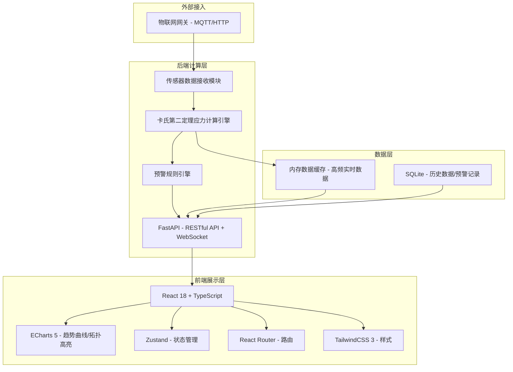
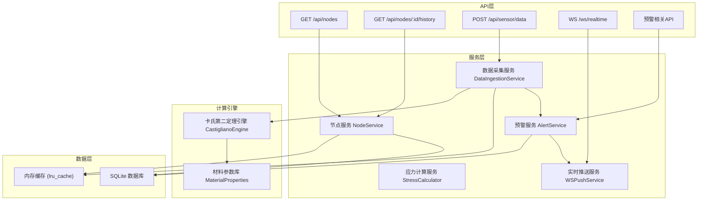
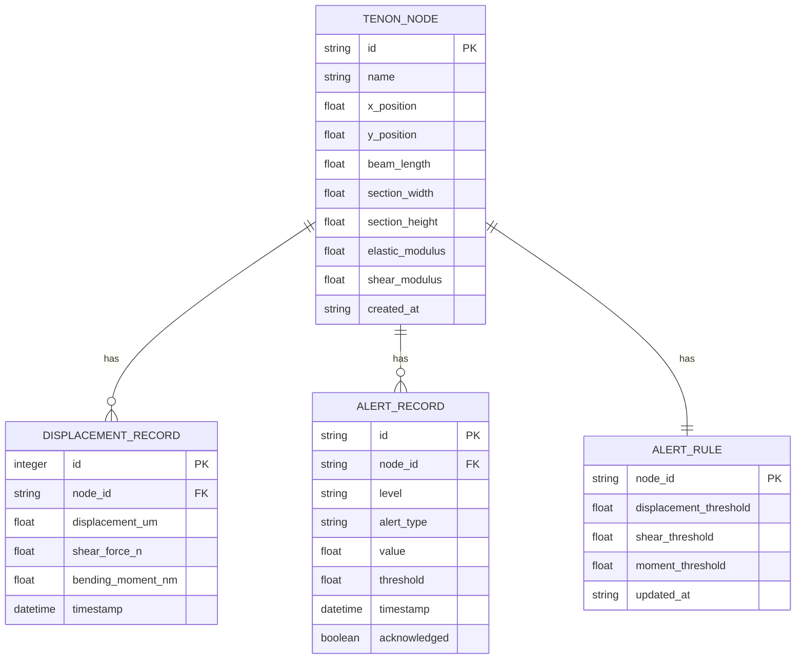

## 1. 架构设计



## 2. 技术说明

- **前端**：React 18 + TypeScript + Vite + TailwindCSS 3 + ECharts 5 + Zustand
- **构建工具**：Vite（开发）+ Webpack 5（生产构建，按需求指定）
- **后端**：Python FastAPI + Uvicorn + NumPy/SciPy（科学计算）
- **数据库**：SQLite（历史数据持久化）+ 内存缓存（实时数据）
- **通信**：HTTP REST API + WebSocket（实时推送）
- **部署**：前后端分离，前端静态文件由 Nginx 或 FastAPI 静态挂载

## 3. 路由定义

| 路由 | 用途 |
|------|------|
| /dashboard | 监测总览页（默认页） |
| /node/:id | 节点详情页 |
| /alerts | 预警中心页 |

## 4. API 定义

### 4.1 REST API

```typescript
// 榫卯节点信息
interface TenonNode {
  id: string;
  name: string;
  position: { x: number; y: number };
  beamLength: number;      // 梁长 (m)
  sectionWidth: number;    // 截面宽 (m)
  sectionHeight: number;   // 截面高 (m)
  elasticModulus: number;  // 弹性模量 (Pa)
  shearModulus: number;    // 剪切模量 (Pa)
  displacement: number;    // 当前相对位移 (μm)
  shearForce: number;      // 剪切力 (N)
  bendingMoment: number;   // 弯矩 (N·m)
  stressLevel: 'normal' | 'warning' | 'danger';
  lastUpdate: string;
}

// 位移历史数据点
interface DisplacementPoint {
  timestamp: string;
  displacement: number;  // μm
  shearForce: number;    // N
  bendingMoment: number; // N·m
}

// 预警记录
interface AlertRecord {
  id: string;
  nodeId: string;
  nodeName: string;
  level: 'warning' | 'danger';
  type: 'displacement' | 'shear' | 'moment';
  value: number;
  threshold: number;
  timestamp: string;
  acknowledged: boolean;
}

// 预警规则
interface AlertRule {
  nodeId: string;
  displacementThreshold: number; // μm
  shearThreshold: number;        // N
  momentThreshold: number;       // N·m
}
```

| 方法 | 路径 | 说明 |
|------|------|------|
| GET | /api/nodes | 获取所有节点列表及当前应力 |
| GET | /api/nodes/:id | 获取单节点详情 |
| GET | /api/nodes/:id/history | 获取节点历史数据（支持时间范围参数） |
| POST | /api/sensor/data | 物联网网关推送传感器数据 |
| GET | /api/alerts | 获取预警记录列表 |
| PUT | /api/alerts/:id/ack | 确认预警 |
| GET | /api/rules | 获取预警规则 |
| PUT | /api/rules/:nodeId | 更新节点预警规则 |
| GET | /api/topology | 获取古构架拓扑结构数据 |
| WS | /ws/realtime | WebSocket 实时数据推送 |

### 4.2 卡氏第二定理计算说明

对于悬臂梁模型的榫卯节点，利用卡氏第二定理（Castigliano's Second Theorem）：

**位移 δ 与应变能 U 的关系**：
- δ = ∂U/∂F
- 应变能 U = U_bending + U_shear

**弯曲应变能**：
- U_bending = ∫(M²(x))/(2EI) dx

**剪切应变能**：
- U_shear = ∫(k·V²(x))/(2GA) dx

**逆向求解**（给定位移 δ，反求力 F）：
- 对于悬臂梁端部受集中力 F，端部挠度 δ = FL³/(3EI) + kFL/(GA)
- 反推：F = δ / (L³/(3EI) + kL/(GA))
- 弯矩：M = F·L

其中：
- E：木材弹性模量
- G：木材剪切模量
- I：截面惯性矩
- A：截面积
- k：截面形状系数（矩形截面取 6/5）
- L：梁长

## 5. 后端架构图



## 6. 数据模型

### 6.1 数据模型定义



### 6.2 数据库初始化

系统启动时自动创建 SQLite 数据库表，并初始化预置的古建木构架节点数据（模拟全木钟楼的核心榫卯节点）。
